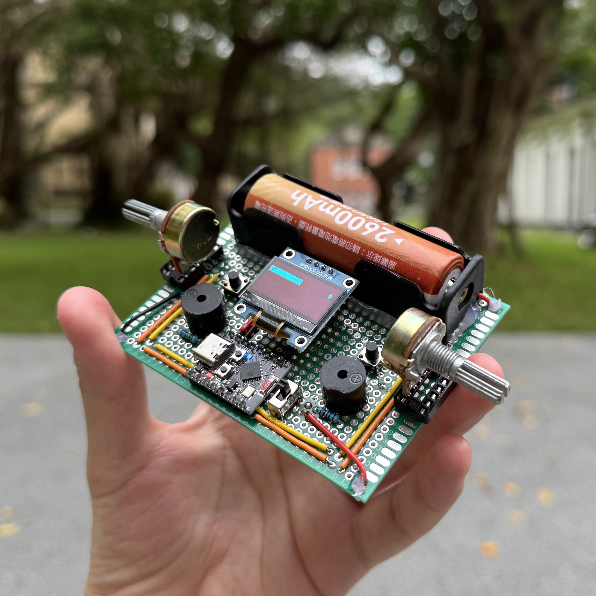

# Pong Wars

## About

- The Pong Wars project initially started as a simple weekend project that I made in C to practice creating applications with their own window to display graphics. If you'd like more information about the C program, visit the [software](https://github.com/kyriosaa/pong-wars/tree/main/software) folder!.

- From there, I decided to port the program over to an ESP32 project and made a physical device for users to play. If you'd like more information about the device & ESP32 program, visit the [embedded](https://github.com/kyriosaa/pong-wars/tree/main/embedded) folder!.