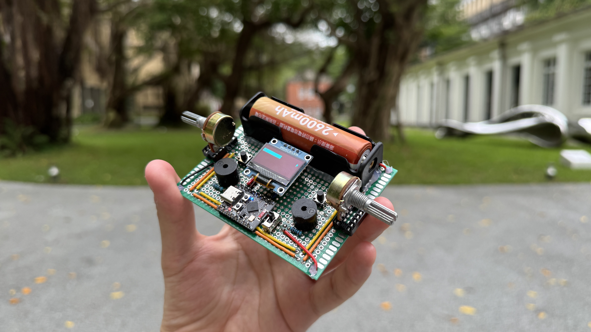
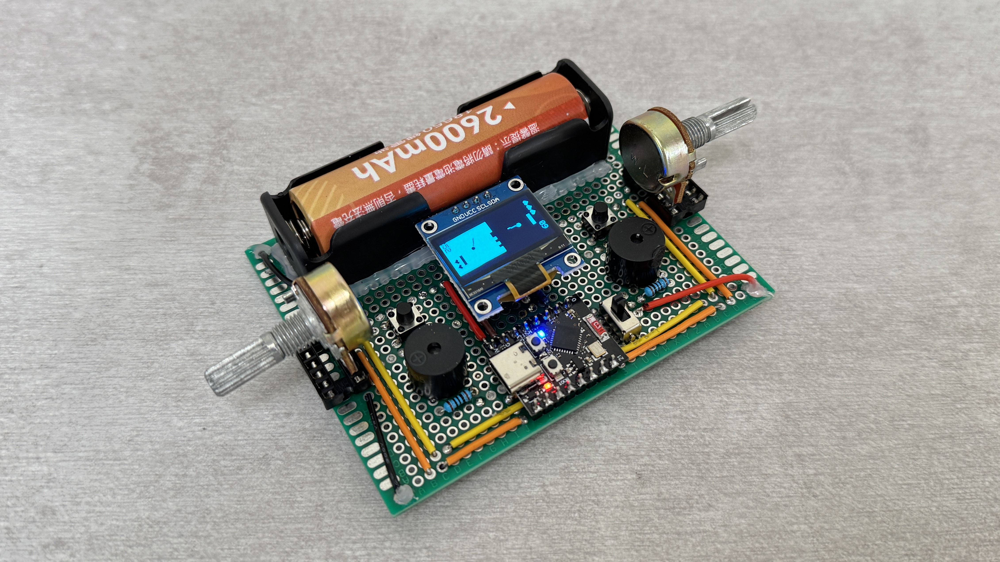
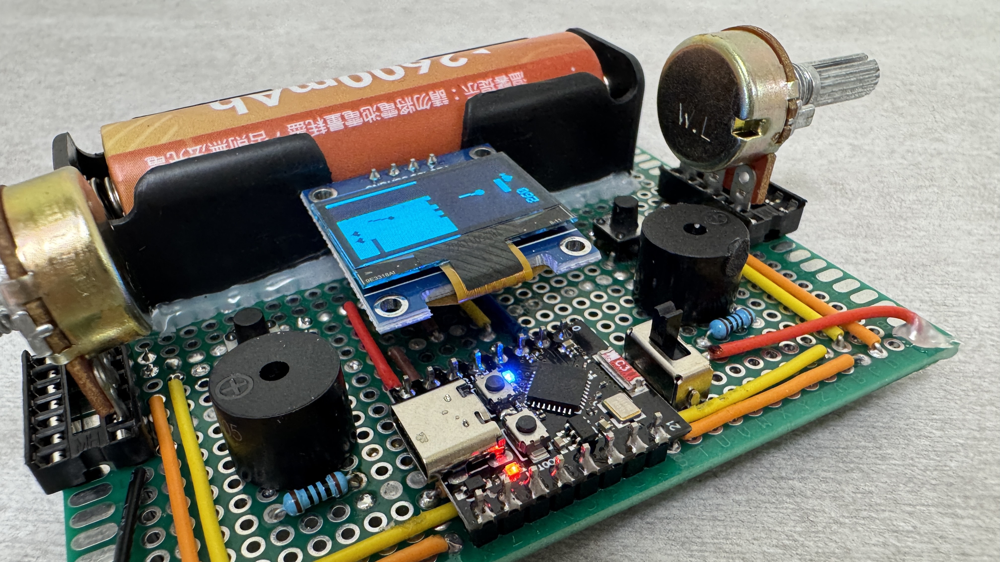
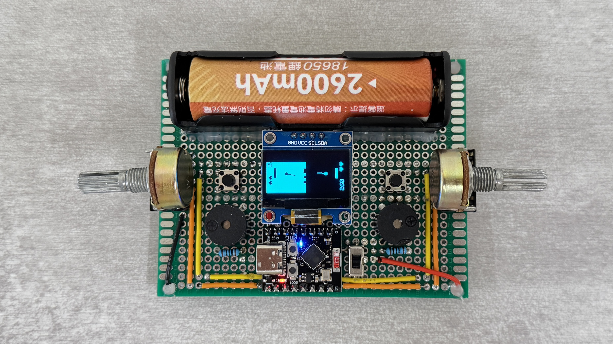

# Pong Wars

A tactile multiplayer gaming device that fits in your pocket.

## Gameplay

A life-based pong game where you take the enemy's territory.

Before the game starts, both players aim their circles using the potentiometer. Once either side's button is pressed, the game starts and both players move their paddle around using the potentiometer to try and take the enemy's territory.

At any moment during the game, either player can press their button to reset their circle and re-aim.

Each player has three lives and once all three are gone, the game ends and the player with the most territory wins.

## Features

- **Portability -** The device is powered by a 18650 battery and can be turned on without a wall connection. 
- **Simple UI -** A simple and easily understandable user interface is present on the device's OLED screen.
- **Tactile Controls -** All game controls are tactile and give responsive feedback when interacted with.
- **Responsive Audio -** The device's built-in buzzers give an audio response for the game's interactions such as taking territory and losing life.

## Hardware Components

- **ESP32C3 Super Mini -** System microcontroller
- **128x64 OLED Screen -** Screen to display game elements
- **Potentiometers -** Smooth variable controls for aim/paddle
- **Push Buttons -** Buttons for switching game states or resetting circles
- **Buzzers -** Audio for responsive gameplay
- **Slide Switch -** For turning the device on/off
- **3.7V 2600mAh 18650 Li-ion Battery**

